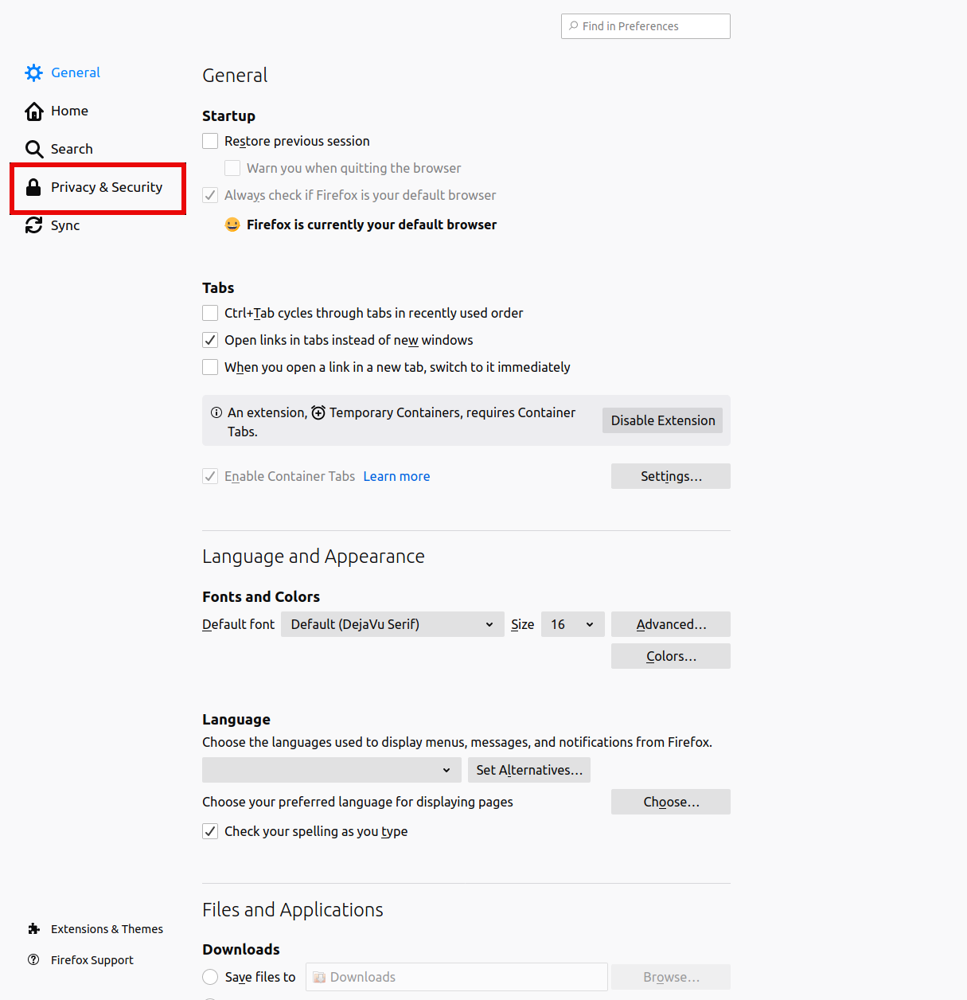
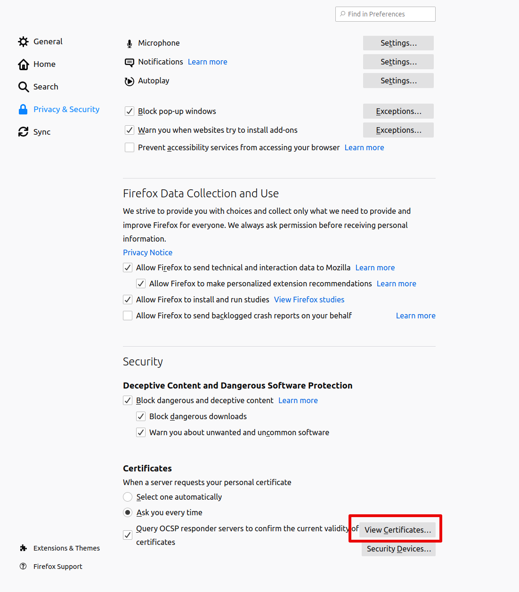
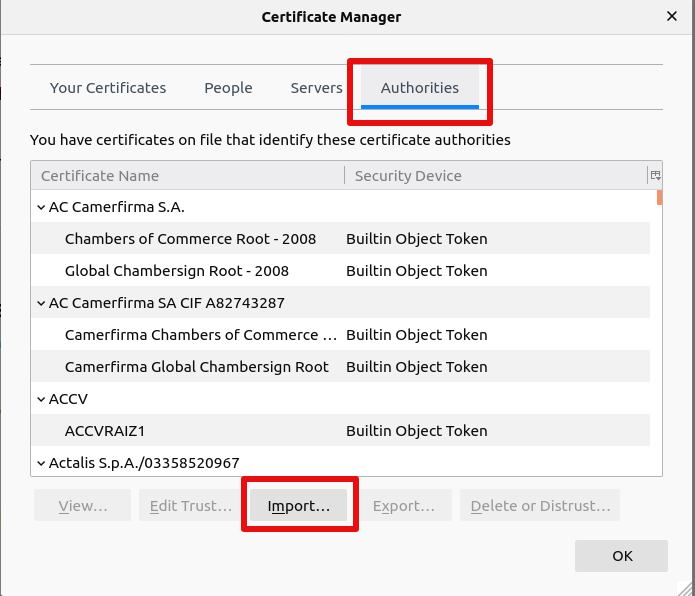
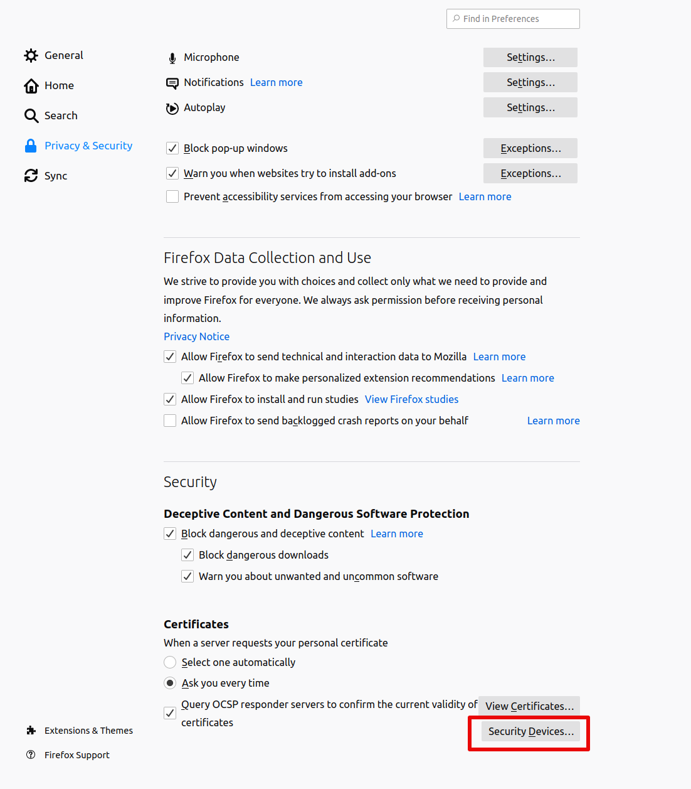
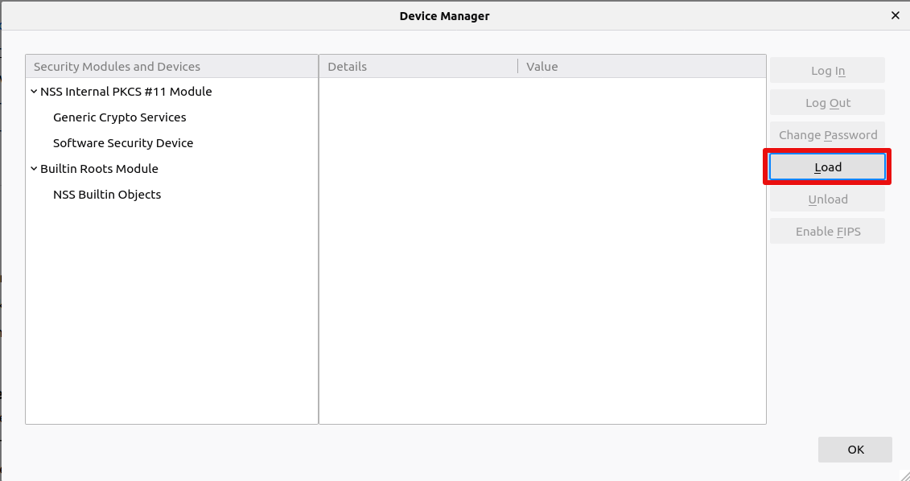
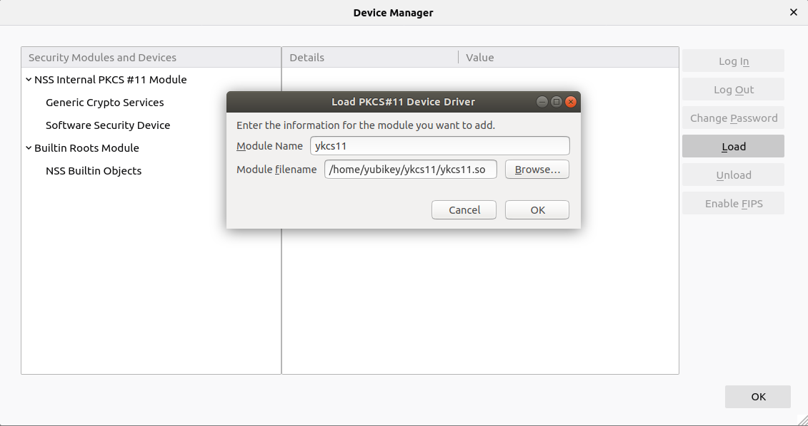
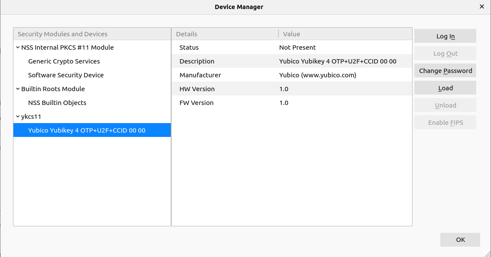
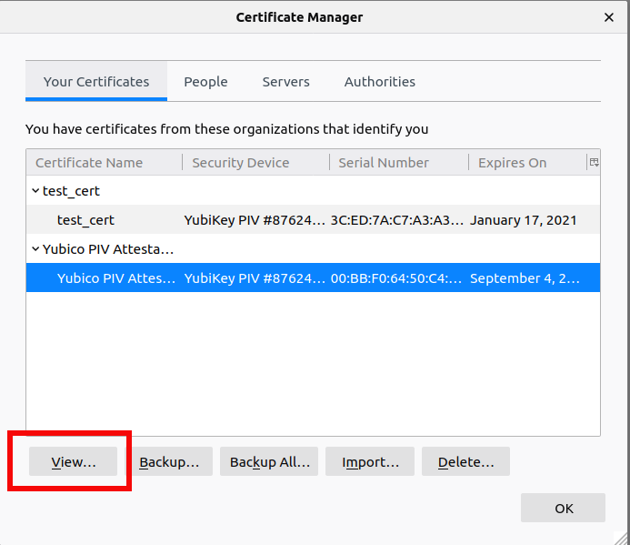
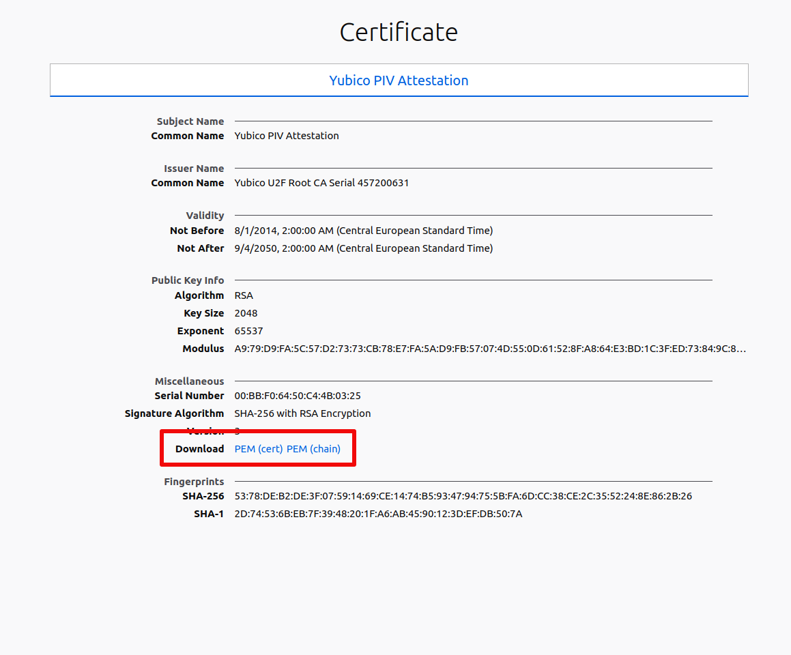

== FireFox

With FireFox, it is possible to authenticate to websites and other web services with certificates stored on a smartcard and accessed through a PKCS#11 module. In order to do that, the PKCS#11 module needs to be added to FireFox as a Security Device. However, in order for FireFox to recognize the certificate in the smartcard, it needs to have previously imported its issuer certificate (typically a CA certificate) as a trusted authority.

=== Importing CA Certificate
1. Open FireFox Certificate Manager. Go to Preferences -> Privacy & Security -> View Certificates...
+

+

2. Go to “Authorities” and click "Import"
+

3. Navigate to the issuer certificate and choose it.

=== Adding YKCS11 Security Device
1. Open FireFox Device Manager. Go to Preferences -> Privacy & Security -> Security Devices…
+

2. Click “Load”
+

3. Choose a name for the YKCS11 module, navigate to libykcs11.so and choose it then klick OK. The YKCS11 module should now appear in the Security devices column to the left.
+

+

=== Viewing and Downloading a Certificate

CAUTION: If the certificate issuer is not trusted (aka not imported) by FireFox, the certificate details will only show an error message

1. Open FireFox Certificate Manager. Go to Preferences -> Privacy & Security -> View Certificates…

2. Highlight the certificate and click “View...”. The certificate details will be displayed in a FireFox tab
+

3. To download the certificate, find the download link in the certificate details tab. It is possible to download only the certificate or the entire certificate chain in PEM format.
+

=== Other Functionality

With FireFox, it is possible to access and download the certificate. It is also possible to change the PIV user pin with the "Change Password" button in the Certificate Manager.

Generally, FireFox has functionality to export the private key (with the "Backup..." button in the Certificate Manager). This, however, will fail since the YubiKey does not allow the private key to leave it.

Deleting a key through FireFox will not work either unless the user is logged in as an SO user.