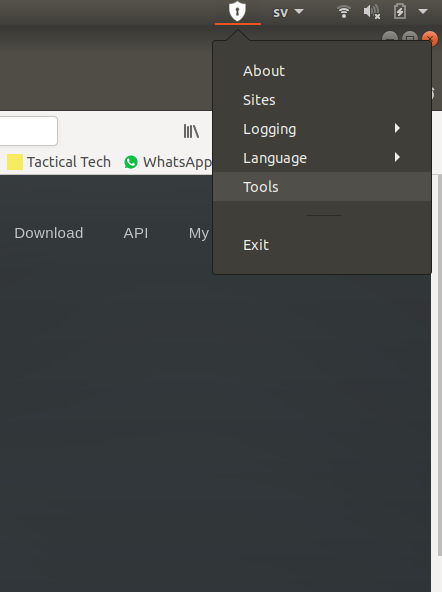
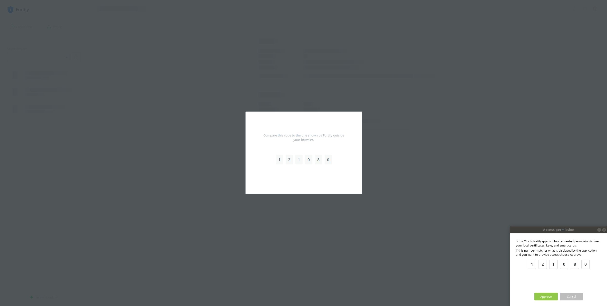
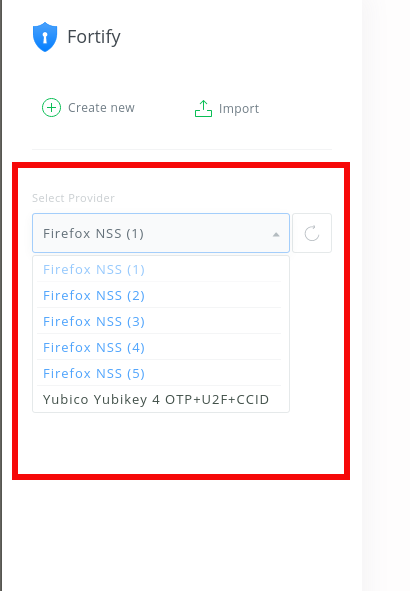
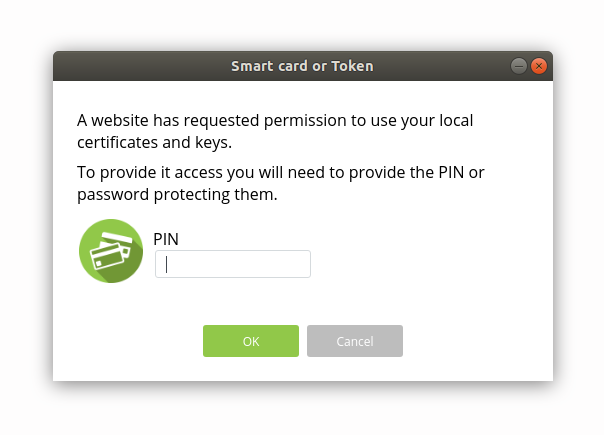
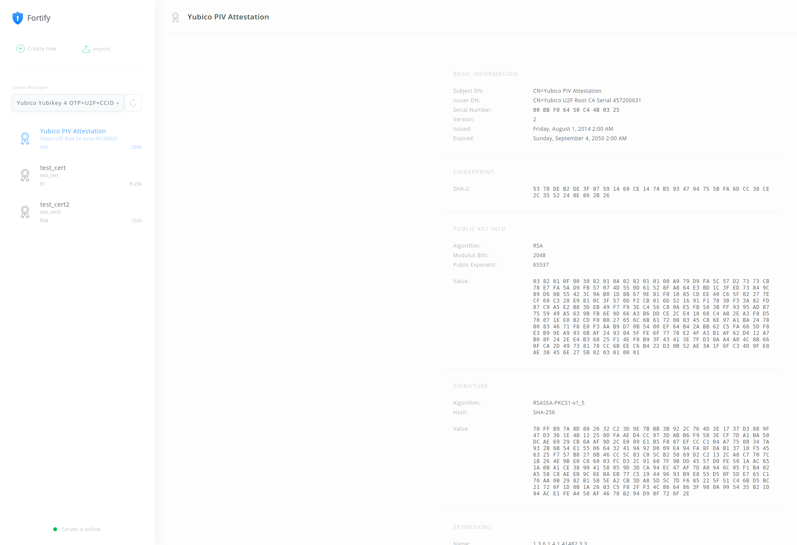

== Fortify

Fortify is a locally installed application that listens on a known TCP port and enables web applications to use smart cards, security tokens and locally installed certificates. Fortify has native support for YubiKey’s PIV interface through the YKCS11 module.

1. Go to https://fortifyapp.com[fortifyapp.com] to download and then install the application specific to your platform

2. When running the application, a small shield-shaped icon close to the "start menu" should appear.

3. Click on the Fortify icon and go to "Tools". The browser will open with the Fortify webapp interface. You will be presented with a code inside the webpage and a code outside of it. If the codes match, click "Approve"
+

+

4. In the Fortify web interface, select the Yubico provider. You will be prompted to enter the PIN of the PIV user. You should then be able to see a list of the certificates stored in the YubiKey
+

+

+

=== Tips

Fortify expects to find the YKCS11 module in the following locations:

[source, bash]
----
MacOS: /usr/local/lib/libykcs11.dylib
Linux: /usr/local/lib/libykcs11.so
Windows: %WINDIR/System32/libykcs11.dll
----

The paths are specified in a file called `card.json`. On a Linux system, this file seems to reside in `$HOME/.fortify/card.json`. 
